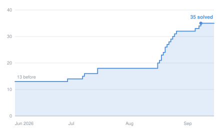
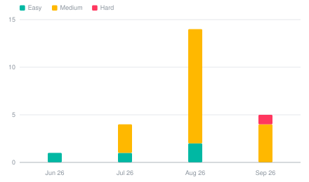
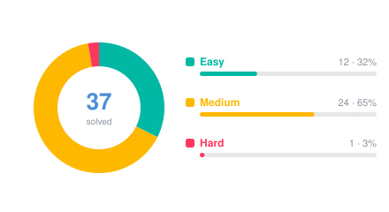
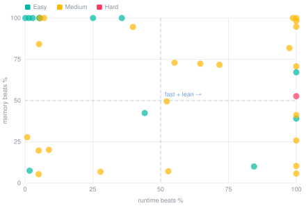
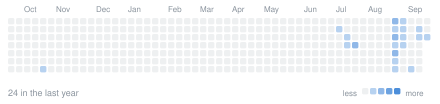
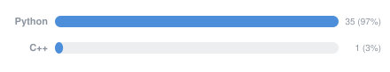

# 🧩 LeetCode Journey

My solved LeetCode problems, one directory per question.
This page is generated from every `info.md` by [`generate_readme.py`](generate_readme.py).

   

## 📊 At a glance

| | |
|:--|:--|
| **Problems solved** | 20 |
| **Submissions recorded** | 20 |
| **Easy** | `██████████░░░░░░░░░░` 10 (50%) |
| **Medium** | `██████████░░░░░░░░░░` 10 (50%) |
| **Hard** | `░░░░░░░░░░░░░░░░░░░░` 0 (0%) |
| **Languages** | Python (19), C++ (1) |
| **Avg. runtime beats** | 40.7% |
| **Avg. memory beats** | 75.1% |
| **First solve** | Jun 08, 2022 |
| **Latest solve** | Aug 16, 2026 (today) |
| **Longest streak** | 4 day(s) |
| **Current streak** | 1 day(s) |
| **Busiest day** | Oct 08, 2023 — 3 problem(s) |

## 📉 The journey in six charts

<table>
<tr>
<td width="50%" valign="top">
<b>📈 Solved over time</b> 
 
</td>
<td width="50%" valign="top">
<b>🗓️ Monthly output</b> 
 
</td>
</tr>
<tr>
<td width="50%" valign="top">
<b>🎯 Difficulty mix</b> 
 
</td>
<td width="50%" valign="top">
<b>⚡ Solution quality</b> 
 
</td>
</tr>
<tr>
<td width="50%" valign="top">
<b>🔥 Activity</b> 
 
</td>
<td width="50%" valign="top">
<b>💻 Languages</b> 
 
</td>
</tr>
</table>

## 🕒 Recently solved

| Date | # | Problem | Difficulty | Language | Runtime beats | Memory beats |
|:--|--:|:--|:--|:--|--:|--:|
| 2026-08-16 | 72 | [Edit Distance](https://leetcode.com/problems/edit-distance/description/) | Medium | Python | 71.68% | 71.68% |
| 2026-08-16 | 61 | [Rotate List](https://leetcode.com/problems/rotate-list/description/) | Medium | Python | 100.00% | 10.35% |
| 2026-07-15 | 150 | [Evaluate Reverse Polish Notation](https://leetcode.com/problems/evaluate-reverse-polish-notation/description/) | Medium | Python | 55.13% | 72.94% |
| 2026-07-15 | 36 | [Valid Sudoku](https://leetcode.com/problems/valid-sudoku/description/) | Medium | Python | 100.00% | 94.76% |
| 2026-07-08 | 530 | [Minimum Absolute Difference in BST](https://leetcode.com/problems/minimum-absolute-difference-in-bst/description/) | Easy | Python | 100.00% | 67.13% |
| 2026-07-07 | 117 | [Populating Next Right Pointers in Each Node II](https://leetcode.com/problems/populating-next-right-pointers-in-each-node-ii/description/) | Medium | Python | 52.83% | 7.12% |
| 2026-06-29 | 26 | [Remove Duplicates from Sorted Array](https://leetcode.com/problems/remove-duplicates-from-sorted-array/description/) | Easy | Python | 44.13% | 42.42% |
| 2025-10-18 | 714 | [Best Time to Buy and Sell Stock with Transaction Fee](https://leetcode.com/problems/best-time-to-buy-and-sell-stock-with-transaction-fee/description/) | Medium | Python | 98.75% | 100.00% |
| 2025-01-10 | 169 | [Majority Element](https://leetcode.com/problems/majority-element/description/) | Easy | Python | 25.08% | 100.00% |
| 2023-10-08 | 392 | [Is Subsequence](https://leetcode.com/problems/is-subsequence/description/) | Easy | Python | 2.80% | 100.00% |

---

Generated by <code>generate_readme.py</code> on 2026-08-16.
