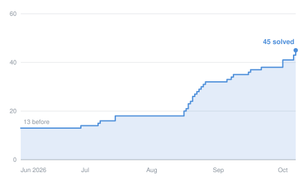
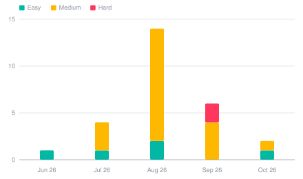
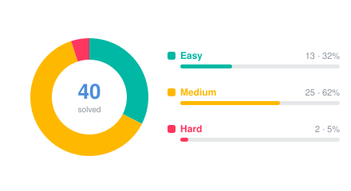
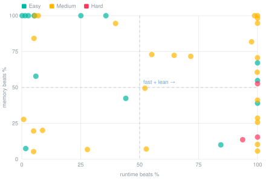
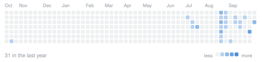
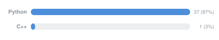

# 🧩 LeetCode Journey

My solved LeetCode problems, one directory per question.
This page is generated from every `info.md` by [`generate_readme.py`](generate_readme.py).

   

## 📊 At a glance

| | |
|:--|:--|
| **Problems solved** | 40 |
| **Submissions recorded** | 40 |
| **Easy** | `██████░░░░░░░░░░░░░░` 13 (32%) |
| **Medium** | `████████████░░░░░░░░` 25 (62%) |
| **Hard** | `█░░░░░░░░░░░░░░░░░░░` 2 (5%) |
| **Languages** | Python (37), Java (2), C++ (1) |
| **Avg. runtime beats** | 52.6% |
| **Avg. memory beats** | 60.3% |
| **First solve** | Jun 08, 2022 |
| **Latest solve** | Oct 01, 2026 (today) |
| **Longest streak** | 11 day(s) |
| **Current streak** | 1 day(s) |
| **Busiest day** | Oct 08, 2023 — 3 problem(s) |

## 📉 The journey in six charts

<table>
<tr>
<td width="50%" valign="top">
<b>📈 Solved over time (since Jun 2026)</b> 
 
</td>
<td width="50%" valign="top">
<b>🗓️ Monthly output (since Jun 2026)</b> 
 
</td>
</tr>
<tr>
<td width="50%" valign="top">
<b>🎯 Difficulty mix</b> 
 
</td>
<td width="50%" valign="top">
<b>⚡ Solution quality</b> 
 
</td>
</tr>
<tr>
<td width="50%" valign="top">
<b>🔥 Activity</b> 
 
</td>
<td width="50%" valign="top">
<b>💻 Languages</b> 
 
</td>
</tr>
</table>

## 🕒 Recently solved

| Date | # | Problem | Difficulty | Language | Runtime beats | Memory beats | Code |
|:--|--:|:--|:--|:--|--:|--:|:-:|
| 2026-10-01 | 205 | [Isomorphic Strings](https://leetcode.com/problems/isomorphic-strings/description/) | Easy | Java | 5.98% | 57.83% | — |
| 2026-10-01 | 12 | [Integer to Roman](https://leetcode.com/problems/integer-to-roman/description/) | Medium | Java | 99.87% | 60.64% | — |
| 2026-09-21 | 124 | [Binary Tree Maximum Path Sum](https://leetcode.com/problems/binary-tree-maximum-path-sum/description/) | Hard | Python | 93.68% | 13.64% | [📄](0124_binary-tree-maximum-path-sum/solution.py) |
| 2026-09-16 | 68 | [Text Justification](https://leetcode.com/problems/text-justification/description/) | Hard | Python | 100.00% | 52.63% | [📄](0068_text-justification/solution.py) |
| 2026-09-15 | 199 | [Binary Tree Right Side View](https://leetcode.com/problems/binary-tree-right-side-view/description/) | Medium | Python | 100.00% | 70.72% | [📄](0199_binary-tree-right-side-view/solution.py) |
| 2026-09-08 | 215 | [Kth Largest Element in an Array](https://leetcode.com/problems/kth-largest-element-in-an-array/description/) | Medium | Python | 5.01% | 19.69% | [📄](0215_kth-largest-element-in-an-array/solution.py) |
| 2026-09-07 | 221 | [Maximal Square](https://leetcode.com/problems/maximal-square/description/) | Medium | Python | 52.24% | 49.47% | [📄](0221_maximal-square/solution.py) |
| 2026-09-05 | 92 | [Reverse Linked List II](https://leetcode.com/problems/reverse-linked-list-ii/description/) | Medium | Python | 100.00% | 25.76% | [📄](0092_reverse-linked-list-ii/solution.py) |
| 2026-08-26 | 189 | [Rotate Array](https://leetcode.com/problems/rotate-array/description/) | Medium | Python | 8.81% | 20.12% | [📄](0189_rotate-array/solution.py) |
| 2026-08-25 | 97 | [Interleaving String](https://leetcode.com/problems/interleaving-string/description/) | Medium | Python | 64.63% | 72.37% | [📄](0097_interleaving-string/solution.py) |

---

Generated by <code>generate_readme.py</code> on 2026-10-01.
